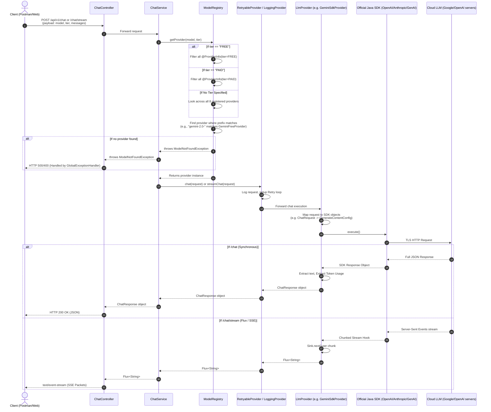

# Inf-Alpha `/chat` End-to-End Flow

Below is the complete sequence diagram detailing how a request flows through the tiered routing gateway.

```mermaid
sequenceDiagram
    autonumber
    
    actor User as Client (Postman/Web)
    participant Controller as ChatController
    participant Service as ChatService
    participant Registry as ModelRegistry
    participant Decorator as RetryableProvider / LoggingProvider
    participant Provider as LlmProvider (e.g. GeminiSdkProvider)
    participant SDK as Official Java SDK (OpenAI/Anthropic/GenAI)
    participant Cloud as Cloud LLM (Google/OpenAI servers)

    User->>Controller: POST /api/v1/chat or /chat/stream<br/>(payload: model, tier, messages)
    
    %% Service Layer
    Controller->>Service: Forward request
    
    %% Routing Logic
    Service->>Registry: getProvider(model, tier)
    
    alt If tier == "FREE"
        Registry->>Registry: Filter all @ProviderInfo(tier=FREE)
    else If tier == "PAID"
        Registry->>Registry: Filter all @ProviderInfo(tier=PAID)
    else If No Tier Specified
        Registry->>Registry: Look across all 8 registered providers
    end
    
    Registry->>Registry: Find provider where prefix matches<br/>(e.g., "gemini-2.0-" matches GeminiFreeProvider)
    
    alt If no provider found
        Registry-->>Service: throws ModelNotFoundException
        Service-->>Controller: throws ModelNotFoundException
        Controller-->>User: HTTP 500/400 (Handled by GlobalExceptionHandler)
    end
    
    Registry-->>Service: Returns provider instance
    
    %% Execution via Decorators
    Service->>Decorator: chat(request) or streamChat(request)
    Decorator->>Decorator: Log request, setup Retry loop
    
    Decorator->>Provider: Forward chat execution
    
    %% SDK Level
    Provider->>Provider: Map request to SDK objects<br/>(e.g. ChatRequest -> GenerateContentConfig)
    
    Provider->>SDK: execute()
    SDK->>Cloud: TLS HTTP Request
    
    %% Streaming vs Sync
    alt If /chat (Synchronous)
        Cloud-->>SDK: Full JSON Response
        SDK-->>Provider: SDK Response Object
        Provider->>Provider: Extract text, Extract Token Usage
        Provider-->>Decorator: ChatResponse object
        Decorator-->>Service: ChatResponse object
        Service-->>Controller: ChatResponse object
        Controller-->>User: HTTP 200 OK (JSON)
        
    else If /chat/stream (Flux / SSE)
        Cloud-->>SDK: Server-Sent Events stream
        SDK-->>Provider: Chunked Stream Hook
        Provider->>Provider: Sink.next() per chunk
        Provider-->>Decorator: Flux<String>
        Decorator-->>Service: Flux<String>
        Service-->>Controller: Flux<String>
        Controller-->>User: text/event-stream (SSE Packets)
    end
```
